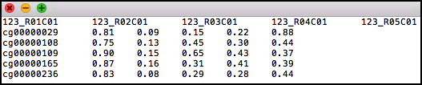
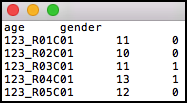
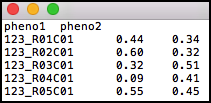

Input
=====

GLINT accepts as input array methylation data that were generated using the Illumina arrays (27K, 450K and EPIC). The following section describes the arguments that allow to provide data files for GLINT, and the `--gsave`_ argument that allows to save and work with a binary version of the data (`GLINT files`_) for gaining speed-up in computation.

.. note:: GLINT assumes that input data are given after raw data preprocessing (i.e. after normalization).

.. note:: GLINT currently does not allow NA values in the data. For users having NA values in their data files see `handling NA values`_.

|
|

Input files
^^^^^^^^^^^

We recommend using the `tutorial files`_ as an example for the required file formats.

.. _tutorial files: blank

.. _--datafile:

**--datafile:**	

Path to a file containing sites by samples matrix of methylation levels. The first row should include sample identifiers and the first column should include CpG identifiers. The first row may include the field "ID" at the beginning. The file can be either tab-delimited, comma-delimited or space-delimited. The matrix entries are not allowed to include quotes.

For example, adding the following to your GLINT command::

	--datafile datafile.txt

will load the methylation data matrix in the *datafile.txt* file. See the tutorial *datafile.txt* file as an example file.

    Figure 1: Example of a data file.

.. note:: In order to speed-up GLINT, we recommend working with a binary version of the data. See `--gsave`_ for more details.

.. note:: For users having *.Rdata* files with methylation data we provide a script for generating files in the required format - see `Convert RData file into GLINT format`_ for more details.

.. _--covarfile: 

**--covarfile**

Path to a file containing samples by covariates matrix. The first row may be a row of headers - the names of the covariates, and the first column should include sample identifiers. The first row, if provided headers, may include the field "ID" at the beginning. If a row of headers is not provided then GLINT will automatically generate a name for each covariate. The file can be either tab-delimited, comma-delimited or space-delimited. The matrix entries are not allowed to include quotes, and covariates must be numeric (i.e. categorial covariates should be encoded numerically).

For example, adding the following to your GLINT command::

	--covarfile covariates.txt

will provide the covariates matrix in the *covariates.txt* file. See the tutorial *covariates.txt* file as an example file.

    Figure 2: Example of a covariates file.

.. note:: More than one covariates file can be provided, e.g. *--covarfile covariates1.txt covariates2.txt*.

.. _--phenofile:

**--phenofile**

Path to a file containing samples by phenotypes matrix. The first row may be a row of headers - the names of the phenotypes, and the first column should include sample identifiers. The first row, if provided headers, may include the field "ID" at the beginning. If a row of headers is not provided then GLINT will automatically generate a name for each phenotype. The file can be either tab-delimited, comma-delimited or space-delimited. The matrix entries are not allowed to include quotes, and phenotypes must be numeric (i.e. categorial phenotypes should be encoded numerically).

For example, adding the following to your GLINT command::

	--phenofile phenotypes.txt

will provide the phenotypes matrix in the *phenotypes.txt* file. See the tutorial *phenotypes.txt* file as an example file.

    Figure 3: Example of a phenotypes file.

.. note:: More than one phenotypes file can be provided, e.g. *--phenofile phenotypes1.txt phenotypes2.txt*.

.. _--out:

**--out**

Allows to change the default titles of output files. Use this argument for changing the prefix of the default title of each argument that produces output files.

For example::

	python glint.py --datafile datafile.txt --gsave --out newdata

will generate GLINT files (see `--gsave`_) with *newdata* prefix.

|
|

.. _GLINT files:

GLINT files
^^^^^^^^^^^

.. _--gsave:

**--gsave**

Saves GLINT files, including a binary version of the methylation data (*.glint* file) for gaining computation speed-up in the following commands. In addition, this command saves two additional files:

- *datafile.sites.txt* - contains the CpG identifiers of the sites in the data and additional information for each CpG: chromosome, position, nearest gene and genomic category.

- *datafile.samples.txt* - contains the sample identifiers of the samples in the data. If `--covarfile`_ and `--phenofile`_ are used then this file also includes the phenotypes and covariates for each sample.

For example::

	python glint.py --datafile datafile.txt --gsave

will save a binary data file titled *datafile.glint* and two additional files titled *datafile.samples.txt* and *datafile.sites.txt*. The following command:

::

	python  glint.py --datafile datafile.txt --covarfile covariates.txt --phenofile phenotypes.txt --gsave

will also include the covariates and phenotypes information found in the *covariates.txt* and *phenotypes.txt* files in the *datafile.samples.txt* file.

.. note:: Never change the *datafile.samples.txt* and *datafile.site.txt* files manually. Changes can be made using the `data management`_ commands.

.. _data management: datamanagement.html

.. _--txtsave:

**--txtsave**

Allows to save a textual version of the data contained in a binary *.glint* file.

For example::

	python glint.py --datafile datafile.glint --txtsave

will create a file titled *datafile.txt* with a textual version of the methylation matrix in *datafile.glint*.

.. note:: `--txtsave`_ can be also used to save a new version of textual format of previous textual files (i.e. `--txtsave`_ is not restricted to get *.glint* file as an input).

|
|

.. _Convert RData file into GLINT format:

Convert R file to GLINT format
^^^^^^^^^^^^^^^^^^^^^^^^^^^^^^

**convertToGlintInput.R:**

We provide this R script for users having methylation data matrix in *.RData* format. This script gets as an input *.RData* file with sites by samples methylation data matrix saved as a data frame or a matrix variable with CpGs identifiers as row names and sample identifiers as column names. In addition to the *.RData* file name, the script optionally can take two additional arguments:

- varname - if more than a single data frame / matrix variable exists in the *.RData* file then the name of the methylation data variable should be provided. If this argument is not provided then the script automatically attemps to find data frame or a matrix variable.
- transpose - if the methylation data matrix is formatted as samples by sites rather than sites by samples then providing this argument with the value 'true' will transpose the data matrix.

For example::

	Rscript convertToGlintInput.R datafile.RData X

will save a tab-delimited text file containing sites by samples methylation data matrix as appear in the variable X that is saved in the *datafile.RData* file. The resulted file can be then provided as an input to GLINT (using `--datafile`_).

|

Alternatively::

	Rscript convertToGlintInput.R datafile.RData X true

will assume that the information in the variable X is formatted as samples by sites and therefore should be transposed.

|
|

.. _handling NA values:

Handling NA values
^^^^^^^^^^^^^^^^^^

GLINT currently does not allow NA values in the data. For users having NA values in their data we provide an external script *replace_missing_values.py* for a basic imputation of NA values.
This script replaces NA values of each site with its mean methylation level (according to all non-NA values of the site), and outputs a new data file with no NA values that can be provided to GLINT as an input.

|

*replace_missing_values.py* supports the following arguments:

**--datafile** - path to a data file (required)

**--chr** - the symbol (character) indicating missing values in the input file (required)

**--maxs** - the maximum fraction of missing values allowed per site (required; value between 0 and 1). Sites exceeding this fraction of missing values will be excluded from the output data.

**--maxi** - the maximum fraction of missing values allowed per sample (required; value between 0 and 1). samples exceeding this fraction of missing values will be excluded from the output data.

**--sep** - the delimiter in the data file (optional; default value is "\\t")

**--suffix** - the suffix for the output file name (optional; default value is *.no_missing_values*)

For example::

	python replace_missing_values.py --datafile datafile.txt --chr NA --maxs 0.03 --maxi 0.03

will save a tab-delimited text file titled *datafile.no_missing_values* with imputed values for matrix entries with "NA" values. The resulted file will not include sites and samples having more than 3% missing values.

