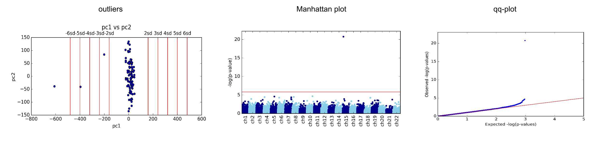

Plots
========

.. _--plot:

**--plot**

This argument allows to plot several types of plots, as desribed bellow.

.. note:: The example commands described bellow assume that the user generated `GLINT files`_ with covariates file and phenotypes file.

.. note:: For each plot generated by GLINT two identical figures are saved in two different formats: *.png*  file and *.eps*  file. The latter is a publication quality figure.

.. note:: Use `--out`_ in order to change the default output name.

|
|

Outliers detection
^^^^^^^^^^^^^^^^^^

.. _--plotpcs:

**--plotpcs**

Generates scatter plots for visualizing the couples of principal components (PCs) of the data. The generated plots help in detecting outliers visualy by marking a grid of standard deviations. This plot can guide the selection of values for the `--maxpcstd`_ argument.

For example::

	python glint.py --datafile datafile.glint --plot --plotpcs

will generate a figure titled *pcs_plot.png* with scatter plots of the first couple of PCs of the data (you can change the number of PCs couples to plot with the --numpcs flag as described below).

**--numpcs**

Allows to select the number of PCs to plot when using the `--plotpcs`_ argument (default is 2).

For example::

	python glint.py --datafile datafile.glint --plot --plotpcs --numpcs 3

will plot scatter plots of the first 3 PCs of the data

|
|

Visualize EWAS results
^^^^^^^^^^^^^^^^^^^^^^

The following arguments allow to generate plots based on result files generated using the `--ewas`_ argument.

.. note:: The `--plot`_ argument can be used together with `--ewas`_ in order to run EWAS and plot the results in a single command. More than one plot can be selected.

.. _--qqplot:

**--qqplot**

Generates a qq-plot from a results file generated by running `--ewas`_.

For example::

	python glint.py --datafile datafile.glint --plot --qqplot results.glint.linreg.txt 

will generate a qq-plot from the results in the *results.glint.linreg.txt* file.

Alternatively, run directly with EWAS::

	python glint.py --datafile datafile.glint --ewas --linreg --plot --qqplot

.. _--manhattan:

**--manhattan**

Generates a Manhattan plot from a results file generated by running `--ewas`_.

For example::

	python glint.py --datafile datafile.glint --plot --manhattan results.glint.linreg.txt 

will generate Manhattan plot from the results in the *results.glint.linreg.txt* file.

Alternatively, run directly with EWAS::

	python glint.py --datafile datafile.glint --ewas --linreg --plot --manhattan

.. _--maxpcstd: datamanagement.html#maxpcstd

.. _--out: input.html#out

.. _--ewas: ewas.html#ewas

.. _GLINT files: input.html#glint-files

