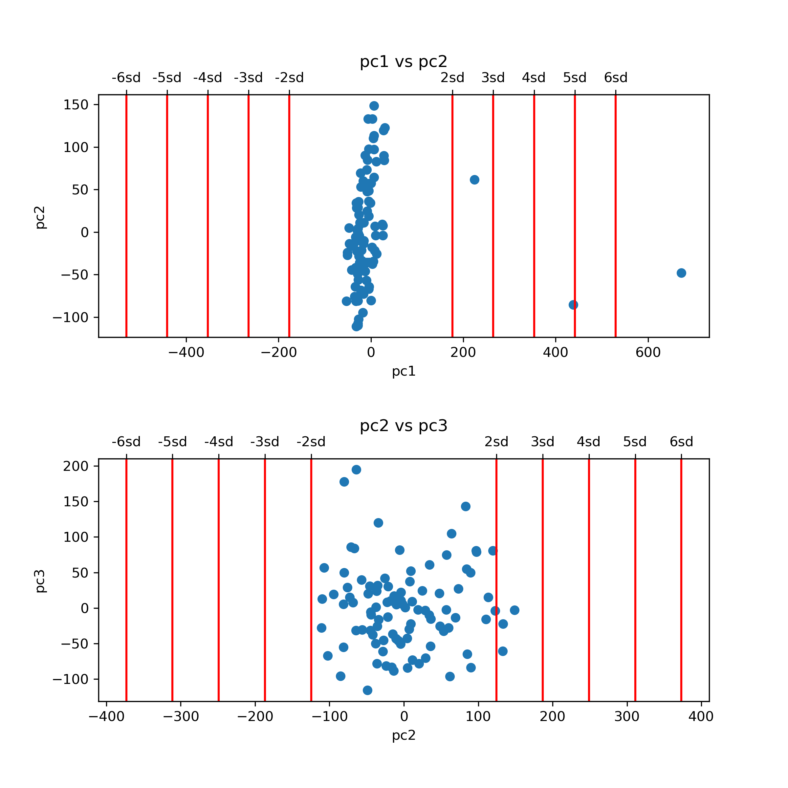
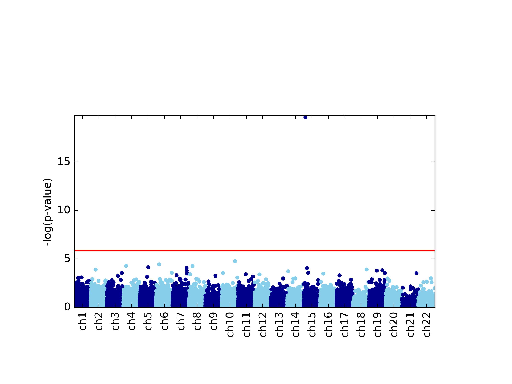
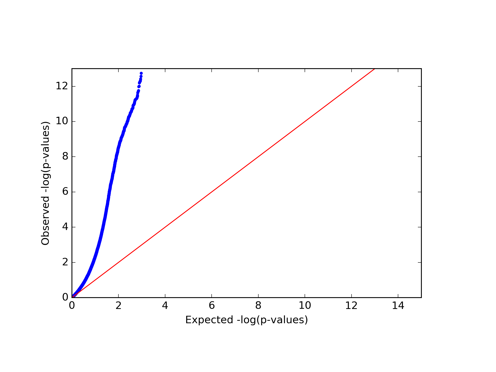
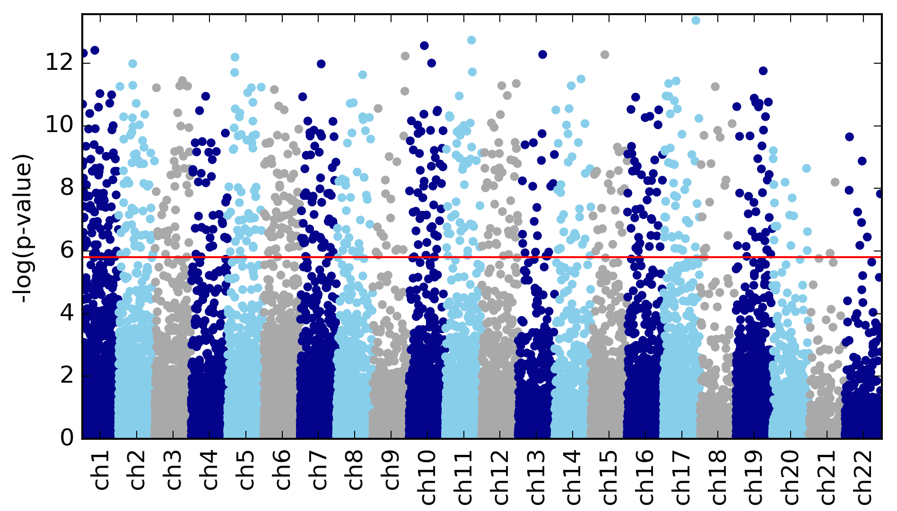

Quick start tutorial
====================

This tutorial will quickly walk you through the basic functionality of glint.
For this tutorial we use subset of a public dataset from GEO (accession ID GSE77716_; the  dataset is described in details in Rahmani et al. [1]_). In order to run this tutorial you will need to `download glint`_ and to get the tutorial files from here_. The tutorial files include:

- *datafile.txt* - 50,000 sites by 100 samples matrix of methylation levels
- *covariates.txt* - covariates matrix for the samples, each column corresponds to one covaraite.
- *phenotypes.txt* - phenotypes matrix for the samples, each column corresponds to one phenotype.

.. Files and figures generated by this tutorial can be found under the 'results' directory in the tutorial files directory.

Bellow is a set of simple commands, together composing a full pipeline of EWAS analysis (after raw data normalization). The following assumes the user is in the directory of the tutorial files and that glint was added to the path (see "Download and installation" for more details). For more details about any specific argument see the documentation.

1. **Creating glint files**

First, we start by saving a binary version of our data: the methylation data file, covariates and phenotypes of interest. This step will allow a substantial speed-up in all following commands.

::

	python glint.py --datafile datafile.txt --covarfile covariates.txt --phenofile phenotypes.txt --gsave --out data

Following this command we now have *data.glint* file, a binary version of the methylation data, and two additional files, *data.samples.txt* and *data.sites.txt*, providing textual information about the samples and sites in the data.

2. **Detecting outliers**

We begin the analysis by looking for outliers in the data. We first run:
	
::

	python glint.py --datafile data.glint --plot --plotpcs --numpcs 2 --out pcs_plot

This command will generate a figure titled *pcs_plot.png*, showing scatter plots of the first two principal components (PCs) of the data. Note that an additional figure will be generated, *pcs_plot.eps*, a publication quality version of the same figure.

3. **Removing outliers**

For this tutorial we consider samples with values more extreme than 4 sandard deviations (SDs) in their first two PCs as outliers. Currently, have 2 outliers in our data, as reflected in the top panel of the *pcs_plot.png* figure.
We remove these outlier samples by indicating 4 SDs as the maximum level allowed for PC number 1::

	python glint.py --datafile data.glint --maxpcstd 1 4 --gsave --out data_cleaned

As before, we are using the `--gsave`_ argument for generating glint files, this time without outliers. This will result in the following files: *data_cleaned.glint*, *data_cleaned.samples.txt* and *data_cleaned.sites.txt* files.

4. **Estimating cell type composition**

Since our data were collected from heterogeneous source (blood tissue), we run ReFACTor for estimating the cell type composition in the data and generate new glint files with the results. The resulted ReFACTor components will be used later as covariates in our EWAS, as tissue heterogeneity is a potential confounder in EWAS [2]_ . For best performance, we run ReFACTor while adding potential genome-wide effectors as covariates. We do that by adding the `--covar`_ argument which allows us to add covariates by their names (as they appear in the covariates file):

::

	python glint.py --datafile data_cleaned.glint --refactor --k 6 --covar gender chip1 chip2 chip3 chip4 chip5 chip6 chip7 chip8 --gsave --out data_cleaned_v2

This command resulted in *data_cleaned_v2.refactor.components.txt* and *rdata_cleaned_v2.efactor.rankedlist.txt* files (see "Tissue heterogeneity" for more details). In addition, we now have updated glint files: *data_cleaned_v2.glint*, *data_cleaned_v2.samples.txt* and *data_cleaned_v2.sites.txt*.
Note that *data_cleaned_v2.samples.txt* includes new covariates: rc1, rc2, ..., rck - these are the ReFACTor components.

5. **Estimating population structure**

Since our data were collected from admixed population and we do not have ancestry information available, we estimate the population structure in the data from the methylation levels using the Epistructure algorithm [3]_ and generate new glint files with the results. For best performance, we run Epistructure while adding strong genome-wide effectors as covariates - in our case we add the estimates of the cell composition.
The resuled Epistructure PCs will be used later as covariates in our EWAS::

	python glint.py --datafile data_cleaned_v2.glint --epi --covar rc1 rc2 rc3 rc4 rc5 rc6 --gsave --out data_final

This command resulted in a file titled *data_final.epistructure.pcs.txt* (see "inferring population structure" for more details). In addition, we now have *data_final.glint*, *data_final.samples.txt* and *data_final.sites.txt* files.
Note that *data_final.samples.txt* includes a new covariate named "epi1", which is the first Epistructure component (by default `--epi`_ outputs one PC).

6. **Running EWAS**

We are now ready to run association test for each site. In this tutorial we will run EWAS on a simulated phenotype (selected using the `--pheno`_ argument, according to the phenotype's name in the phenotypes file). Since the phenotype is continuous we will use a linear regression model, and we will include the ReFACTor components and the Epistructure components in the analysis in order to account for tissue heterogeneity and population structure. In addition, using the `--stdth`_ argument we can neglect nearly constant sites having very low variability, and using the arguments `--rmxy`_, `--rmns`_ and `--rmpoly`_, we can also neglect X and Y chromosome sites, cross-reactive sites and polymorphic sites [4]_.

::

	python glint.py --datafile data_final.glint --ewas --linreg --pheno y1 --covar rc1 rc2 rc3 rc4 rc5 rc6 epi1 --stdth 0.01 --rmxy --rmns --rmpoly

This command outputs a file titled *results.glint.linreg.txt* with the results of the association test. Note that the results are sorted by their association p-value.

7. **Plotting results**

Lastly, we would like to plot the results in the results.glint.linreg.txt file. glint allows to visualize the data by plotting a qq-plot (`--qqplot`_) and a Manahattan plot (`--manhattan`_) as follows.::

	python glint.py --plot --qqplot --manhattan --results results.glint.linreg.txt

This command generates four figures. The first two, *results.glint.qqplot.png* and *results.glint.manhattan.png*, show a qq-plot and a Manhattan plot of the results. The last two are publication quality versions of the same figures (*.eps* files).

.. image:: figs/results.glint.qqplot.png
    :width: 40%
    :align: center

8. **Unadjusted EWAS**

Finally, in our example we found a single significant association in chromosome 15 (cg20510272), as reflected in the qq-plot and in the Manhattan plot. The phenotype we used here was simulated to be correlated with the cell composition in the data and only one site (cg20510272) was artificially changed to be causal with respect to the phenotype. Since the phenotype is correlated with the cell type composition, performing uncorrected analysis is expected to result in many spurious assocaitions. We can easily see that by running an unadjusted EWAS by simply repeating the EWAS analysis, this time without including the covaraites. Here, we use a single command for running the EWAS analysis and generating the plots at the same time:

::

	python glint.py --datafile data_final.glint --ewas --linreg --pheno y1 --stdth 0.01 --rmxy --rmns --rmpoly --plot --qqplot --manhattan --out unadjusted

|
|

.. _here: blank

.. _download glint: download.html

.. _GSE77716: https://www.ncbi.nlm.nih.gov/geo/query/acc.cgi?acc=GSE77716

.. _--gsave: input.html#gsave

.. _--covar: tissueheterogeneity.html#covar

.. _--epi: popstructure.html#epi

.. _--pheno: ewas.html#pheno

.. _--stdth: datamanagement.html#stdth

.. _--rmxy: datamanagement.html#rmxy

.. _--rmns: datamanagement.html#rmns

.. _--rmpoly: datamanagement.html#rmpoly

.. _--qqplot: plots.html#qqplot

.. _--manhattan: plots.html#manhattan

.. citations are in Chcago format

.. [1] Rahmani, Elior, Noah Zaitlen, Yael Baran, Celeste Eng, Donglei Hu, Joshua Galanter, Sam Oh et al. "Sparse PCA corrects for cell type heterogeneity in epigenome-wide association studies." Nature methods 13, no. 5 (2016): 443-445.
.. [2] Jaffe, Andrew E., and Rafael A. Irizarry. "Accounting for cellular heterogeneity is critical in epigenome-wide association studies." Genome biology 15, no. 2 (2014): 1.
.. [3] Rahmani, Elior, Liat Shenhav, Regev Schweiger, Paul Yousefi, Karen Huen, Brenda Eskenazi, Celeste Eng et al. "Genome-wide methylation data mirror ancestry information." bioRxiv (2016): 066340.
.. [4] Chen, Yi-an, Mathieu Lemire, Sanaa Choufani, Darci T. Butcher, Daria Grafodatskaya, Brent W. Zanke, Steven Gallinger, Thomas J. Hudson, and Rosanna Weksberg. "Discovery of cross-reactive probes and polymorphic CpGs in the Illumina Infinium HumanMethylation450 microarray." Epigenetics 8, no. 2 (2013): 203-209.

