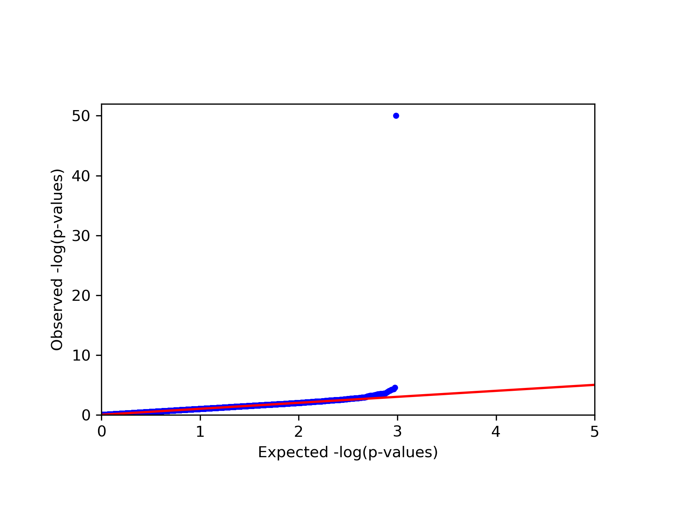
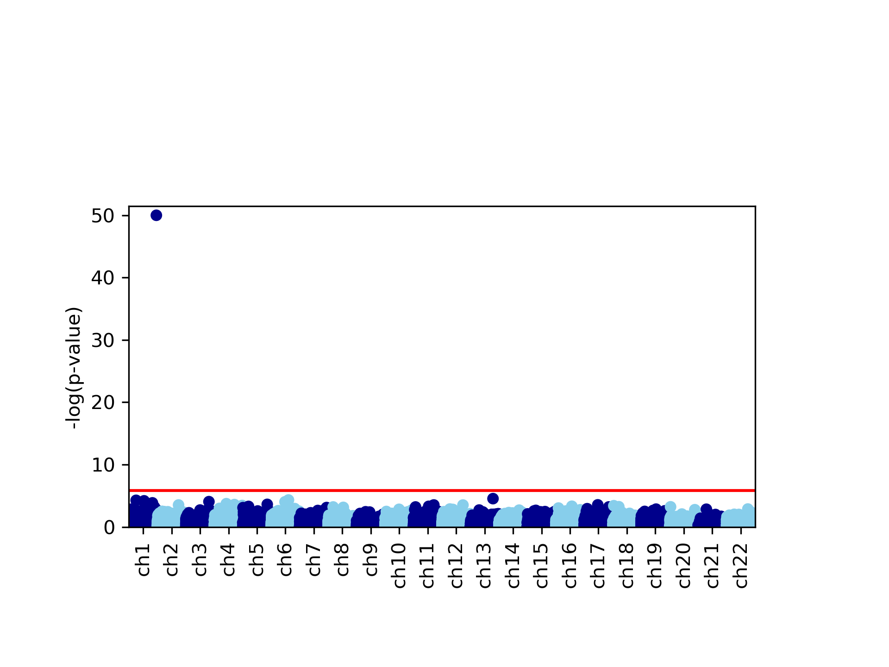
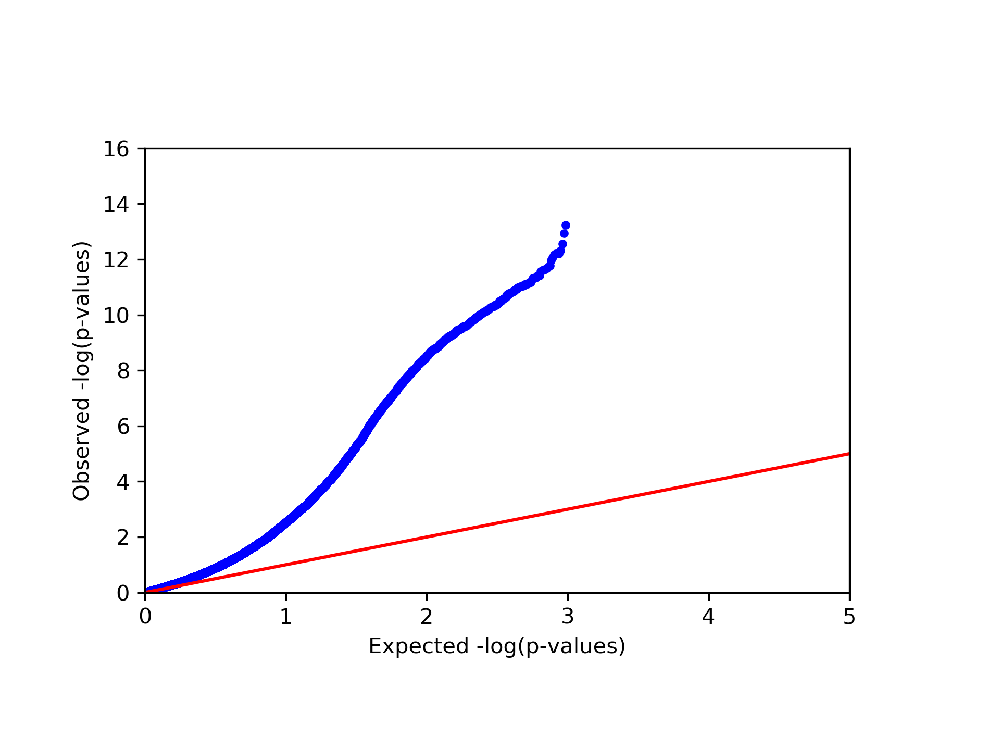
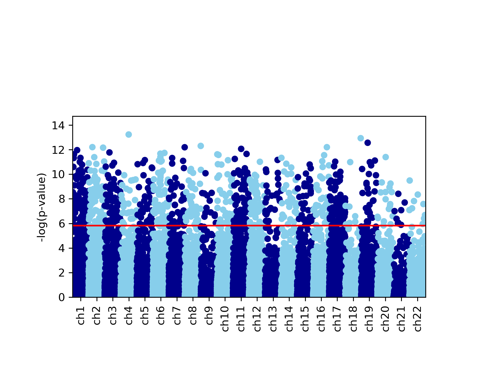

Quick start tutorial
====================

This tutorial will quickly walk you through the basic functionality of GLINT.
For this tutorial we use subset of a public dataset from GEO (accession ID GSE77716_; the  dataset is described in details in Rahmani et al. [1]_). In order to run this tutorial you will need to `download GLINT`_ and to get the tutorial files from here_. The tutorial files include:

- *datafile.txt* - 50,000 sites by 96 samples matrix of methylation levels
- *covariates.txt* - covariates matrix, each column corresponds to one covariate
- *phenotypes.txt* - phenotypes matrix, each column corresponds to one phenotype

.. Files and figures generated by this tutorial can be found under the 'results' directory in the tutorial files directory.

Bellow is a set of simple commands, together composing a full pipeline of EWAS analysis (after raw data normalization). The commands bellow assume the user downloaded GLINT (see `Download and installation`_) and added the tutorial files into the software's root directory. For more details about any specific argument see the documentation.

1. **Create GLINT files**

First, we start by saving a binary version of our data: the methylation data file, covariates and phenotypes of interest. This step will allow a substantial speed-up in all following commands. Navigate to the GLINT directory and run the following:

::

	python glint.py --datafile datafile.txt --covarfile covariates.txt --phenofile phenotypes.txt --gsave

The output of this command is the file *datafile.glint*, a binary version of the methylation data, and two additional files, *datafile.samples.txt* and *datafile.sites.txt*, providing textual information about the samples and sites in the data.

2. **Detect outliers**

We begin the analysis by looking for outliers in the data. We first run:
	
::

	python glint.py --datafile datafile.glint --plot --plotpcs --numpcs 2 --out pcs_plot

This command generates a figure titled *pcs_plot.png*, showing scatter plots of the first two principal components (PCs) of the data. Note that this command also generates an additional figure, *pcs_plot.eps*, a publication quality version of the same figure.

3. **Remove outliers**

For this tutorial we consider samples with values more extreme than 4 sandard deviations (SDs) in their first two PCs as outliers. Following that definition, we currently have 2 outliers in the data, as reflected in the top panel of the *pcs_plot.png* figure.
We remove these outlier samples by indicating 4 SDs as the maximum level allowed for PC number 1::

	python glint.py --datafile datafile.glint --maxpcstd 1 4 --gsave --out data_cleaned

As before, we use the `--gsave`_ argument for generating GLINT files, only this time with outliers excluded. This results in the following files: *data_cleaned.glint*, *data_cleaned.samples.txt* and *data_cleaned.sites.txt* files.

4. **Capture cell type composition**

Since our data were collected from a heterogeneous source (blood tissue), we run ReFACTor in order to account for the cell type composition in the downstream analysis and generate new GLINT files with the results. The resulted ReFACTor components will be used later as covariates in our EWAS analysis, as tissue heterogeneity is a potential confounder in EWAS [2]_. In order to boost ReFACTor's performance in capturing the cell composition, we run ReFACTor while adding potential methylation altering factors as covariates. We do that by using the `--covar`_ argument which allows us to add covariates by their names (as they appear in the covariates file):

::

	python glint.py --datafile data_cleaned.glint --refactor --k 6 --covar age gender chip1 chip2 chip3 chip4 chip5 chip6 chip7 chip8 --gsave --out data_cleaned_v2

This command creates *data_cleaned_v2.refactor.components.txt* and *data_cleaned_v2.efactor.rankedlist.txt* files (see `Tissue heterogeneity`_ for more details), and updated GLINT files: *data_cleaned_v2.glint*, *data_cleaned_v2.samples.txt* and *data_cleaned_v2.sites.txt*.
Note that *data_cleaned_v2.samples.txt* includes new covariates: rc1, rc2, ..., rck - these are the ReFACTor components.

5. **Infer population structure**

Since our data were collected from admixed population and we do not have ancestry information available, we estimate the population structure in the data directly from the methylation levels using the EPISTRUCTURE algorithm [3]_ and generate new GLINT files with the results. In order to boost the performance of EPISTRUCTURE in capturing the ancestry information, we run EPISTRUCTURE while adding strong genome-wide effectors as covariates - in our case we add the estimates of the cell composition.
The resulted EPISTRUCTURE PCs will be used later as covariates in our EWAS::

	python glint.py --datafile data_cleaned_v2.glint --epi --covar rc1 rc2 rc3 rc4 rc5 rc6 --gsave --out data_final

This command results in a file titled *data_final.epistructure.pcs.txt* (see `Inferring population structure`_ for more details). In addition, we now have *data_final.glint*, *data_final.samples.txt* and *data_final.sites.txt* files.
Note that *data_final.samples.txt* includes a new covariate named *epi1*, which is the first EPISTRUCTURE component (by default `--epi`_ outputs one component).

6. **Run EWAS**

We are now ready to run association test for each site. In this tutorial we will run EWAS on a simulated phenotype. The phenotype is selected using the `--pheno`_ argument, according to the phenotype's name in the phenotypes file. Since our phenotype is continuous we will use a linear regression model, and in addition to standard age and gender covariates, we will include the ReFACTor components and the first EPISTRUCTURE component in the analysis in order to account for tissue heterogeneity and population structure. In addition, using the `--stdth`_ argument we can neglect nearly constant sites having very low variability, and using the arguments `--rmxy`_, `--rmns`_ and `--rmpoly`_, we can also neglect X and Y chromosomes sites, cross-reactive sites and polymorphic sites [4]_.

::

	python glint.py --datafile data_final.glint --ewas --linreg --pheno y1 --covar age gender rc1 rc2 rc3 rc4 rc5 rc6 epi1 --stdth 0.01 --rmxy --rmns --rmpoly

This command outputs a file titled *results.glint.linreg.txt* with the results of the association test. Note that the results are sorted by their association p-value.

7. **Plot results**

Lastly, we would like to plot the results in the *results.glint.linreg.txt* file. GLINT allows to visualize the results by plotting a qq-plot (`--qqplot`_) and a Manahattan plot (`--manhattan`_) as follows.::

	python glint.py --plot --qqplot --manhattan --results results.glint.linreg.txt

This command generates four figures. The first two, *results.glint.qqplot.png* and *results.glint.manhattan.png*, show a qq-plot and a Manhattan plot of the results. The last two are publication quality versions of the same figures (*.eps* files).

8. **Unadjusted EWAS**

Finally, in our example we found a single significant association in chromosome 15 (cg20510272), as reflected in the qq-plot and in the Manhattan plot. The phenotype we used here was simulated to be correlated with the cell type composition in the data and only one site (cg20510272) was artificially changed to be causal with respect to the phenotype. Since the phenotype is correlated with the cell type composition, performing uncorrected analysis is expected to result in many spurious assocaitions. We can easily see that by running an unadjusted EWAS by simply repeating our EWAS analysis, this time without including the ReFACTor components as covariates. Here, we use a single command for running the EWAS analysis and generating the plots at the same time:

::

	python glint.py --datafile data_final.glint --ewas --linreg --pheno y1 --covar age gender epi1 --stdth 0.01 --rmxy --rmns --rmpoly --plot --qqplot --manhattan --out unadjusted

|
|

.. _here: https://github.com/cozygene/glint/releases/download/1.0.0/Tutorial_files.zip

.. _download GLINT: download.html

.. _Download and installation: download.html

.. _Tissue heterogeneity: tissueheterogeneity.html

.. _Inferring population structure: popstructure.html

.. _GSE77716: https://www.ncbi.nlm.nih.gov/geo/query/acc.cgi?acc=GSE77716

.. _--gsave: input.html#gsave

.. _--covar: tissueheterogeneity.html#covar

.. _--epi: popstructure.html#epi

.. _--pheno: ewas.html#pheno

.. _--stdth: ewas.html#stdth

.. _--rmxy: datamanagement.html#rmxy

.. _--rmns: datamanagement.html#rmns

.. _--rmpoly: datamanagement.html#rmpoly

.. _--qqplot: plots.html#qqplot

.. _--manhattan: plots.html#manhattan

.. citations are in Chcago format

.. [1] Rahmani, Elior, Noah Zaitlen, Yael Baran, Celeste Eng, Donglei Hu, Joshua Galanter, Sam Oh et al. "Sparse PCA corrects for cell type heterogeneity in epigenome-wide association studies." Nature methods 13, no. 5 (2016): 443-445.
.. [2] Jaffe, Andrew E., and Rafael A. Irizarry. "Accounting for cellular heterogeneity is critical in epigenome-wide association studies." Genome biology 15, no. 2 (2014): 1.
.. [3] Rahmani, Elior, Liat Shenhav, Regev Schweiger, Paul Yousefi, Karen Huen, Brenda Eskenazi, Celeste Eng et al. "Genome-wide methylation data mirror ancestry information." bioRxiv (2016): 066340.
.. [4] Chen, Yi-an, Mathieu Lemire, Sanaa Choufani, Darci T. Butcher, Daria Grafodatskaya, Brent W. Zanke, Steven Gallinger, Thomas J. Hudson, and Rosanna Weksberg. "Discovery of cross-reactive probes and polymorphic CpGs in the Illumina Infinium HumanMethylation450 microarray." Epigenetics 8, no. 2 (2013): 203-209.

